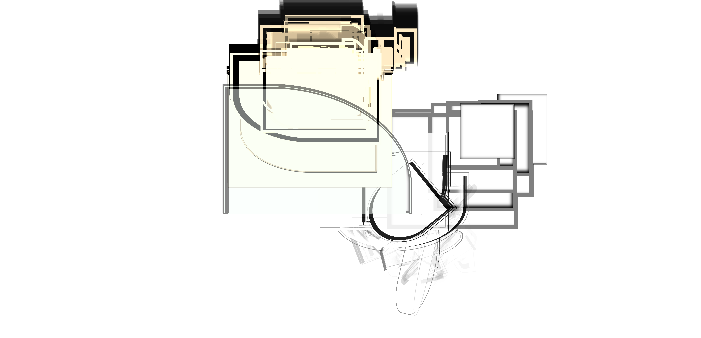
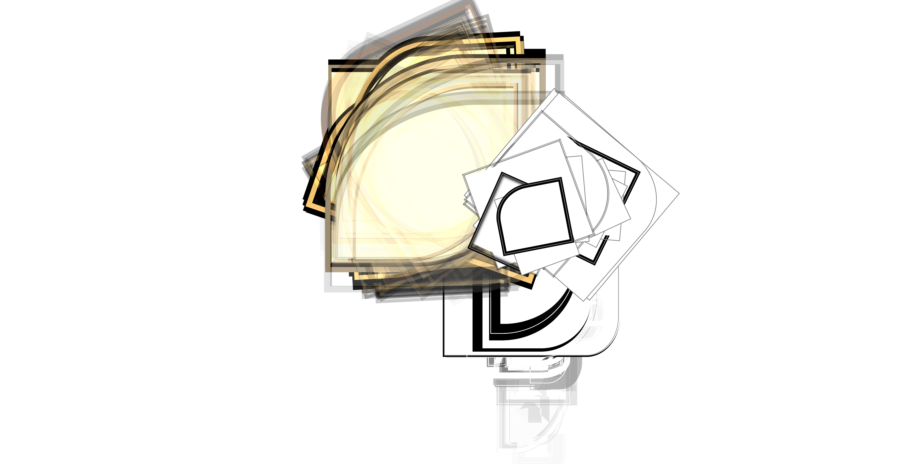
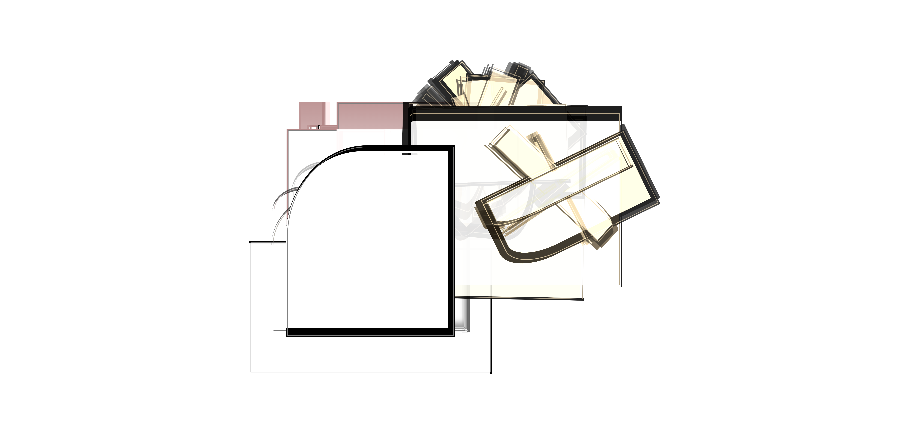
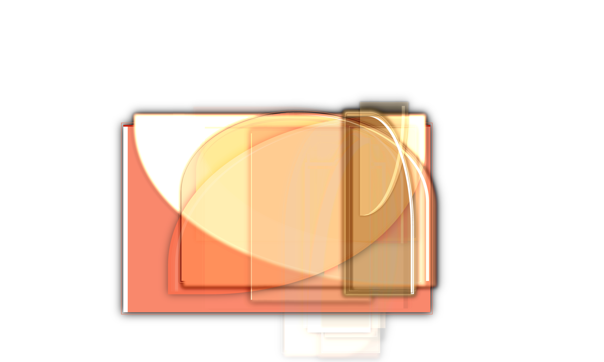
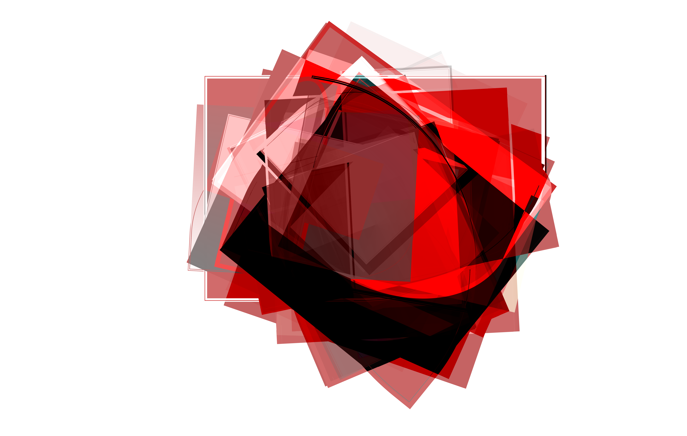
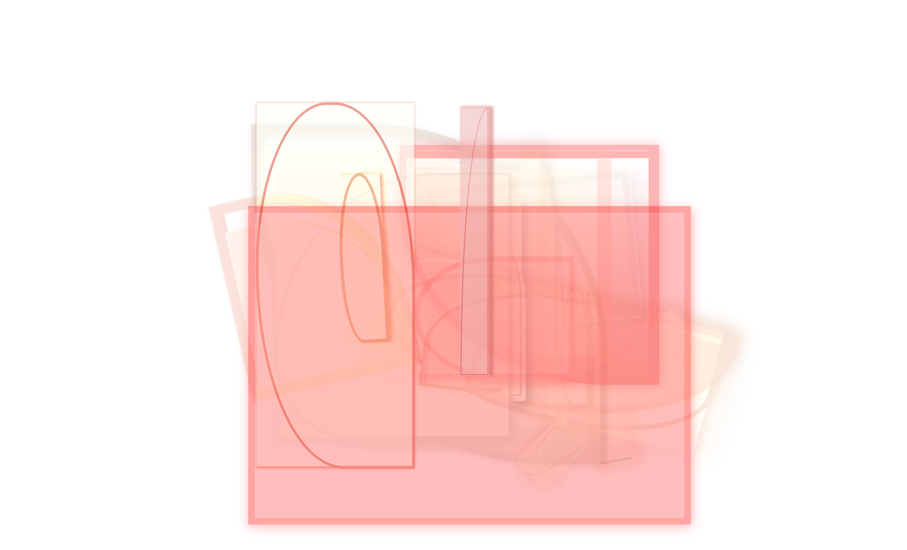

# Artwork-TUI (WIP)
Generative design tool with a terminal UI — compose layouts, render to canvas, export to SVG/PDF. Lorem ipsum dolor sit amet, consetetur sadipscing elitr, sed diam nonumy eirmod tempor invidunt ut labore et dolore magna aliquyam erat, sed diam voluptua. At vero eos et accusam et justo duo dolores et ea rebum. Stet clita kasd gubergren, no sea takimata sanctus est Lorem ipsum dolor sit amet. Lorem ipsum dolor sit amet, consetetur sadipscing elitr, sed diam nonumy eirmod tempor invidunt ut labore et dolore magna aliquyam erat, sed diam voluptua. At vero eos et accusam et justo duo dolores et ea rebum. Stet clita kasd gubergren, no sea takimata sanctus est Lorem ipsum dolor sit amet.

[Installation](#installation) / 
[Configuration](#configuration) / 
[API Reference](#reference) / 
[API Credit](#credit) / 
[Gallery](#gallery)


<br>
<br>

Lorem ipsum dolor sit amet, consetetur sadipscing elitr, sed diam nonumy eirmod tempor invidunt ut labore et dolore magna aliquyam erat, sed diam voluptua. At vero eos et accusam et justo duo dolores et ea rebum. Stet clita kasd gubergren, no sea takimata sanctus est Lorem ipsum dolor sit amet. Lorem ipsum dolor sit amet, consetetur sadipscing elitr, sed diam nonumy eirmod tempor invidunt ut labore et dolore magna aliquyam erat, sed diam voluptua. At vero eos et accusam et justo duo dolores et ea rebum. Stet clita kasd gubergren, no sea takimata sanctus est Lorem ipsum dolor sit amet.

## Installation
Lorem ipsum dolor sit amet, consetetur sadipscing elitr, sed diam nonumy eirmod tempor invidunt ut labore et dolore magna aliquyam erat, sed diam voluptua. At vero eos et accusam et justo duo dolores et ea rebum.

#### Generic Install (Native)
Lorem ipsum dolor sit amet, consetetur sadipscing elitr, sed diam nonumy eirmod tempor invidunt ut labore et dolore magna aliquyam erat, sed diam voluptua

```bash
curl -fsSL https://raw.githubusercontent.com/\
andri-berger/artwork-tui/main/install.sh | sh
```

#### macOS (Homebrew)
Lorem ipsum dolor sit amet, consetetur sadipscing elitr, sed diam nonumy eirmod tempor invidunt ut labore et dolore magna aliquyam erat, sed diam voluptua

```bash
brew install andri-berger/artwork-tui/tap
playwright install chromium #deps are included
```

#### Linux Arch (AUR)
Lorem ipsum dolor sit amet, consetetur sadipscing elitr, sed diam nonumy eirmod tempor invidunt ut labore et dolore magna aliquyam erat, sed diam voluptua

```bash
yay -S artwork-tui #Or use paru instead
playwright install chromium --with-deps
# playwright install firefox --with-deps
```

## Configuration
Lorem ipsum dolor sit amet, consetetur sadipscing elitr, sed diam nonumy eirmod tempor invidunt ut labore et dolore magna aliquyam erat, sed diam voluptua. At vero eos et accusam et justo duo dolores et ea rebum.

```bash
artwork-tui #Launches the TUI
```

<table width="100%">
    <tr>
        <th align="left">KPG</th>
        <th align="left">Terminal</th>
        <th align="left">Plattform</th>
        <th align="left">Notes</th>
    </tr>
    <tr>
        <td>&#x2705;</td>
        <td>Kitty</td>
        <td>Linux, macOS</td>
        <td>The originator — reference implementation</td>
    </tr>
    <tr>
        <td>&#x2705;</td>
        <td>Ghostty</td>
        <td>Linux, macOS</td>
        <td>The new kid on the block — native support</td>
    </tr>
    <tr>
        <td>&#x2705;</td>
        <td>WezTerm</td>
        <td>Linux, macOS</td>
        <td>Also supports Sixel + iTerm2 protocol — widest coverage</td>
    </tr>
    <tr>
        <td>&#x1F7E1;</td>
        <td>suckless</td>
        <td>Linux</td>
        <td>Patch available implementing a subset of KGP - not built-in</td>
    </tr>
    <tr>
        <td>&#x274C;</td>
        <td>foot</td>
        <td>Linux (Wayland)</td>
        <td>Sixel only — notable omission given it's the go-to Wayland minimal terminal</td>
    </tr>
    <tr>
        <td>&#x274C;</td>
        <td>Alacritty</td>
        <td>Linux, macOS</td>
        <td>Intentionally does not support font ligatures or modern image protocols</td>
    </tr>
    <tr>
        <td>&#x274C;</td>
        <td>iTerm2</td>
        <td>macOS</td>
        <td>Has its own inline image protocol (iTerm2 protocol), not KGP</td>
    </tr>
     <tr>
        <td>&#x274C;</td>
        <td>Konsole</td>
        <td>Linux</td>
        <td>Sixely only</td>
    </tr>
    <tr>
        <td>&#x274C;</td>
        <td>Hyper</td>
        <td>Linux, macOS</td>
        <td>Electron-based, no image protocol</td>
    </tr>
    <tr>
        <td>&#x274C;</td>
        <td>Tabby</td>
        <td>Linux, macOS</td>
        <td>No image protocol</td>
    </tr>
</table>


## API Reference
Lorem ipsum dolor sit amet, consetetur sadipscing elitr, sed diam nonumy eirmod tempor invidunt ut labore et dolore magna aliquyam erat, sed diam voluptua. At vero eos et accusam et justo duo dolores et ea rebum.

<table>
    <tr>
        <th align="left">Key</th>
        <th align="left">Binding</th>
        <th align="left">Description</th>
    </tr>
    <tr>
        <td><kbd>F1
        </kbd></td>
        <td>Delete</td>
        <td>Delete table/grid cell. Think of it as DEL or BACKSPACE in a spreadsheet. </td>
    </tr>
    <tr>
        <td><kbd>F2
        </kbd></td>
        <td>Copy</td>
        <td>Delete table/grid cell. Think of it as Ctrl-C in a spreadsheet. </td>
    </tr>
    <tr>
        <td><kbd>F3
        </kbd></td>
        <td>Cut</td>
        <td>Delete table/grid cell. Think of it as Ctrl-C in a spreadsheet. </td>
    </tr>
    <tr>
        <td><kbd>
        F4</kbd></td>
        <td>Paste</td>
        <td>Delete table/grid cell. Think of it as Ctrl-V in a spreadsheet. </td>
    </tr>
    <tr>
        <td><kbd>
        F5</kbd></td>
        <td>Clear</td>
        <td>Clear the Canvas. Lorem ipsum dolor sit amet.</td>
    </tr>
    <tr>
        <td><kbd>
        F6</kbd></td>
        <td>Afs</td>
        <td>Set Seed for A00-A99 Elements. Lorem ipsum dolor sit amet.</td>
    </tr>
    <tr>
        <td><kbd>
        F7</kbd></td>
        <td>Bfs</td>
        <td>Set Seed for B00-B99. Lorem ipsum dolor sit amet.</td>
    </tr>
    <tr>
        <td><kbd>
        F8</kbd></td>
        <td>Cfs</td>
        <td>Set Seed for C00-C99. Lorem ipsum dolor sit amet.</td>
    </tr>
    <tr>
        <td><kbd>
        F9</kbd></td>
        <td>Create</td>
        <td>Generate Artwork via Random Generator. Lorem ipsum dolor sit amet.</td>
    </tr>
    <tr>
        <td><kbd>
        F10</kbd></td>
        <td>Export</td>
        <td>Export both generated (png) and project file (json) into the directory from where the app was executed / started.</td>
    </tr>
    <tr>
        <td><kbd>
        Tab</kbd></td>
        <td>Navigate</td>
        <td>Cycle forward all navigational UI-Elements. Lorem ipsum dolor sit amet, consetetur sadipscing elitr, sed diam nonumy eirmod tempor invidunt ut labore et dolore magna aliquyam erat.</td>
    </tr>
    <tr>
        <td><kbd>
        Shift-Tab</kbd></td>
        <td>Navigate</td>
        <td>Cycle backward all navigational UI-Elements. Lorem ipsum dolor sit amet, consetetur sadipscing elitr, sed diam nonumy eirmod tempor invidunt ut labore et dolore magna aliquyam erat.</td>
    </tr>
    <tr>
        <td><kbd>
        Arrow-keys</kbd></td>
        <td>Navigation</td>
        <td>Navigate table/grid cells in all directions, left, right, top, bottom. Lorem ipsum dolor sit amet, consetetur sadipscing elitr, sed diam nonumy eirmod tempor invidunt ut labore et dolore magna aliquyam erat.</td>
    </tr>
    <tr>
        <td><kbd>
        BackSpace</kbd></td>
        <td>Navigation</td>
        <td>Lorem ipsum dolor sit amet, consetetur sadipscing elitr, sed diam nonumy eirmod tempor invidunt ut labore et dolore magna aliquyam erat.</td>
    </tr>
    <tr>
        <td><kbd>
        Space</kbd></td>
        <td>Navigation</td>
        <td>Lorem ipsum dolor sit amet, consetetur sadipscing elitr, sed diam nonumy eirmod tempor invidunt ut labore et dolore magna aliquyam erat.</td>
    </tr>
    <tr>
        <td><kbd>
        Enter</kbd></td>
        <td>Navigation</td>
        <td>Lorem ipsum dolor sit amet, consetetur sadipscing elitr, sed diam nonumy eirmod tempor invidunt ut labore et dolore magna aliquyam erat.</td>
    </tr>
    <tr>
        <td><kbd>
        Ctrl-Q</kbd></td>
        <td>System</td>
        <td>Exit the app. Lorem ipsum dolor sit amet, consetetur sadipscing elitr, sed diam nonumy eirmod tempor invidunt ut labore et dolore magna aliquyam erat.</td>
    </tr>
</table>


## API Credit
Lorem ipsum dolor sit amet, consetetur sadipscing elitr, sed diam nonumy eirmod tempor invidunt ut labore et dolore magna aliquyam erat, sed diam voluptua. At vero eos et accusam et justo duo dolores et ea rebum.

<table width="100%">
    <tr>
        <th align="left">Layer</th>
        <th align="left">Name</th>
        <th align="left">
        Link </th>
    </tr>
    </tr>
    <tr>
        <td><kbd>
        Build</kbd></td>
        <td>Apng</td><td>
        <a href="//github.com/apngasm/apngasm">
        https://github.com/apngasm/apng</a></td>
    </tr>
    <tr>
        <td><kbd>
        Build</kbd></td>
        <td>Watch</td><td>
        <a href="//github.com/samuelcolvin/watchfiles">
        https://github.com/samuelcolvin</a></td>
    </tr>
    <tr>
        <td><kbd>
        Build</kbd></td>
        <td>Pip Uv</td><td>
        <a href="//github.com/astral-sh/uv">
        https://github.com/astral-sh/uv</a></td>
    </tr>
    <tr>
        <td><kbd>
        Utilities</kbd></td>
        <td>Numpy</td><td>
        <a href="//github.com/numpy/numpy">
        https://github.com/numpy/numpy</a></td>
    </tr>
    <tr>
        <td><kbd>
        Utilities</kbd></td>
        <td>Random</td><td>
        <a href="https://github.com/d3/d3-random">
        https://github.com/d3/d3-random</a></td>
    </tr>
    <tr>
        <td><kbd>
        Framework</kbd></td>
        <td>Textual</td><td>
        <a href="//github.com/Textualize/textual">
        https://github.com/Textualize/textual</a></td>
    </tr>
    <tr>
        <td><kbd>
        Framework</kbd></td>
        <td>Textual Img</td><td>
        <a href="//github.com/lnqs/textual-image">
        https://github.com/lnqs/textual-image</a></td>
    </tr>
    <tr>
        <td><kbd>
        Conversion</kbd></td>
        <td>Html Image</td><td>
        <a href="//github.com/bubkoo/html-to-image">
        https://github.com/bubkoo/html-to-image</a></td>
    </tr>
    <tr>
        <td><kbd>
        Conversion</kbd></td>
        <td>Playwright</td><td>
        <a href="https://github.com/microsoft/playwright">
        https://github.com/microsoft/playwright</a></td>
    </tr>
    <tr>
        <td><kbd>
        Conversion</kbd></td>
        <td>OpenCV</td><td>
        <a href="https://github.com/opencv/opencv">
        https://github.com/opencv/opencv</a></td>
    </tr>
    <tr>
        <td><kbd>
        Processing</kbd></td>
        <td>PixiJs</td><td>
        <a href="//github.com/pixijs/filters">
        https://github.com/pixijs/filters</a></td>
    </tr>
</table>

Lorem ipsum dolor sit amet, consetetur sadipscing elitr, sed diam nonumy eirmod tempor invidunt ut labore et dolore magna aliquyam erat, sed diam voluptua. At vero eos et accusam et justo duo dolores et ea rebum. Stet clita kasd gubergren, no sea takimata sanctus est Lorem ipsum dolor sit amet. Lorem ipsum dolor sit amet, consetetur sadipscing elitr, sed diam nonumy eirmod tempor invidunt ut labore et dolore magna aliquyam erat, sed diam voluptua. At vero eos et accusam et justo duo dolores et ea rebum. Stet clita kasd gubergren, no sea takimata sanctus est Lorem ipsum dolor sit amet.

## API Gallery
Lorem ipsum dolor sit amet, consetetur sadipscing elitr, sed diam nonumy eirmod tempor invidunt ut labore et dolore magna aliquyam erat, sed diam voluptua. At vero eos et accusam et justo duo dolores et ea rebum. Stet clita kasd gubergren, no sea takimata sanctus est Lorem ipsum dolor sit amet. Lorem ipsum dolor sit amet, consetetur sadipscing elitr, sed diam nonumy eirmod tempor invidunt ut labore et dolore magna aliquyam erat, sed diam voluptua. At vero eos et accusam et justo duo dolores et ea rebum. Stet clita kasd gubergren, no sea takimata sanctus est Lorem ipsum dolor sit amet.

<table>
  <tr>
    <td><a href="Backend/module/1745003993.png">
    
    </a></td>
    <td><a href="Backend/module/1745003866.png">
    
    </a></td>
    <td><a href="Backend/module/1745003804.png">
    
    </a></td>
    <td><a href="Backend/module/1745003726.png">
    
    </a></td>
    <td><a href="Backend/module/1745003613.png">
    
    </a></td>
    <td><a href="Backend/module/1745003563.png">
    
    </a></td>
  </tr>
  <tr>
    <td><a href="Backend/module/1745003407.png">
    
    </a></td>
    <td><a href="Backend/module/1745003074.png">
    
    </a></td>
    <td><a href="Backend/module/1745002977.png">
    
    </a></td>
    <td><a href="Backend/module/1745002888.png">
    
    </a></td>
    <td><a href="Backend/module/1745002495.png">
    
    </a></td>
    <td><a href="Backend/module/1744168809.png">
    
    </a></td>
  </tr>
  <tr>
    <td><a href="Backend/module/1744168798.png">
    
    </a></td>
    <td><a href="Backend/module/1744168791.png">
    
    </a></td>
    <td><a href="Backend/module/1744168777.png">
    
    </a></td>
    <td><a href="Backend/module/1744168764.png">
    
    </a></td>
    <td><a href="Backend/module/1744168743.png">
    
    </a></td>
    <td><a href="Backend/module/1744168733.png">
    
    </a></td>
  </tr>
  <tr>
    <td><a href="Backend/module/1744168727.png">
    
    </a></td>
    <td><a href="Backend/module/1744168722.png">
    
    </a></td>
    <td><a href="Backend/module/1744168599.png">
    
    </a></td>
    <td><a href="Backend/module/1744168593.png">
    
    </a></td>
    <td><a href="Backend/module/1744168591.png">
    
    </a></td>
    <td><a href="Backend/module/1744168589.png">
    
    </a></td>
  </tr>
  <tr>
    <td><a href="Backend/module/1744168586.png">
    
    </a></td>
    <td><a href="Backend/module/1744168580.png">
    
    </a></td>
    <td><a href="Backend/module/1744168563.png">
    
    </a></td>
    <td><a href="Backend/module/1744168542.png">
    
    </a></td>
    <td><a href="Backend/module/1744168532.png">
    
    </a></td>
    <td><a href="Backend/module/1744168518.png">
    
    </a></td>
  </tr>

  <tr>
    <td><a href="Backend/module/1744168512.png">
    
    </a></td>
    <td><a href="Backend/module/1744168505.png">
    
    </a></td>
    <td><a href="Backend/module/1744168452.png">
    
    </a></td>
    <td><a href="Backend/module/1744168430.png">
    
    </a></td>
    <td><a href="Backend/module/1744168424.png">
    
    </a></td>
    <td><a href="Backend/module/1744168421.png">
    <!-- replace with bandcamp album-link !!! -->
    
    </a></td>
  </tr>
</table>


## Rationale

If you encounter any issues, please file an issue on GitHub.
<br>If you find this module useful, please consider starring the repository on GitHub. 

This project began by moving most of the functionality from a commercial WEB SaaS-project https://print-artwork.com (minus the physical print / POD, minus the vectorizer => vtracer), free of charge, now at the complete opposite in copyleft territory, with some additional code-tweaks to accommodate the different UI-requirements in archaic TUI-land as opposed to shiny WEB-land. The app has been split up into the generation part, the meat and bones with this repository, and the glaze/gloss with the sibling <a href="https://github.com/andri-berger/filterx-tui>filterx-TUI">filterx-TUI</a> listed under the same GitHub Profile. Thus, they complement each another really well. One for the substance, the matter, the other for the refinement. 

We strongly believe that the TUI's very own nature, its limitations are its biggest strength! They might outlast every centralized UI-App (UI's are hostage to the cyclic Zeitgeist) due to their self-sufficient, decentralized nature, taking advantage of each user's own infrastructure. The less visual features there are, the less maintenance, the less choices, the less moving parts, the less friction, the more ease of mind, the more sparked creativity, the longer lasting a tool will be — this is our deepest conviction. Ultimately, what we strive for are timeless, stateless conditions, derived from first-order principles, from basic building blocks, be it in Art, Engineering or Elsewhere.


<!-- Abstract Art	
Modern Art	
Geometric Art	
Minimalist Art	
Generative Art	
Algorithmic Art	
Procedural Art	
Contemporary Art	

Abstract Painting
Modern Painting
Geometric Painting
Minimalist Painting
Generative Painting
Algorithmic Painting
Procedural Painting
Contemporary Painting

Create Abstract Art Fast
Your Custom Art in HD
Abstract Prints, Your Way
Make Unique Abstract Art
Design Abstract Art Now
Abstract Art, No AI Needed
Generate Art, Download HD
Abstract Canvas Generator
Abstract Art — Your Style
Make Art, Print on Canvas
Create Abstract Wall Art
DIY Abstract Art Online
High-Res Abstract Prints
Custom Art, Instant File
Abstract Art, No Limits

Design Abstract Wall Art, Print It, Show It Off
Make Abstract Art That’s 100% You — No AI Required
Tired of AI Art? Make Your Own Abstract Masterpiece
Design Abstract Art, Download in HD, Print on Canvas
Create Custom Abstract Art — High-Res, Ready to Print
Abstract Art Generator: From Screen to Wall in Minutes
Generate Abstract Art You Can Actually Download & Print
DIY Abstract Art: Make It, Download It, Print It, Flex It
Design Your Own Abstract Art — No AI, Just Your Imagination
Unleash Your Inner Artist: Create Custom Abstract Art for Print
Your Vision, Your Art: Generate Stunning Abstracts, Download or Print
Make custom abstract art in minutes. Download or print your masterpiece!
Design your abstract art and print it or download high-res files instantly.
Create unique abstract artwork online — print on canvas or download HD art.
Generate abstract art that’s 100% yours. Print or save high-resolution art.
Your art, your rules. Create abstract pieces, download, or print on canvas.
-->

<br>
<br>
<br>
