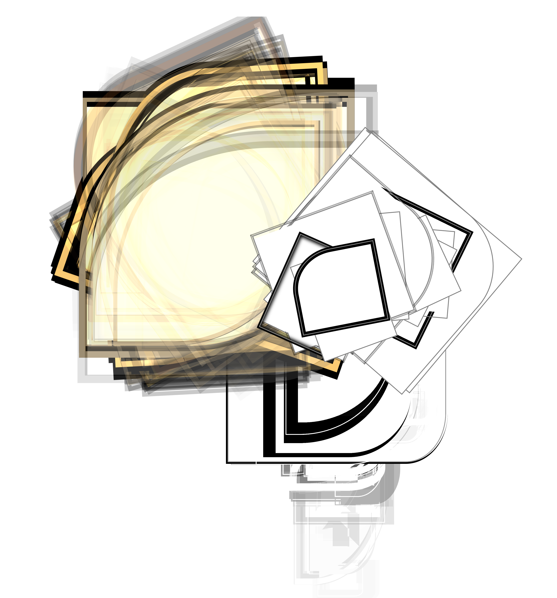
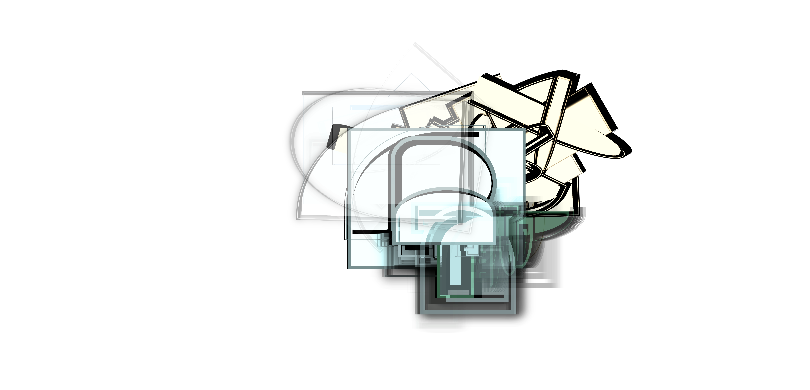
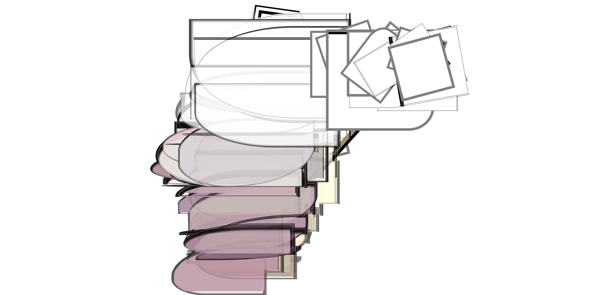
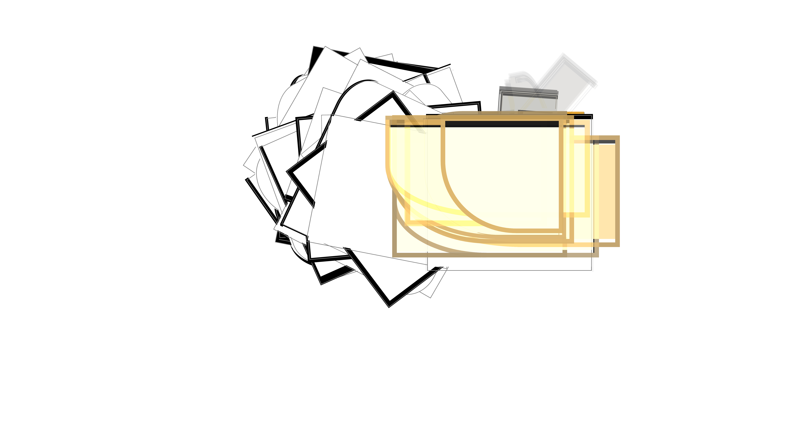
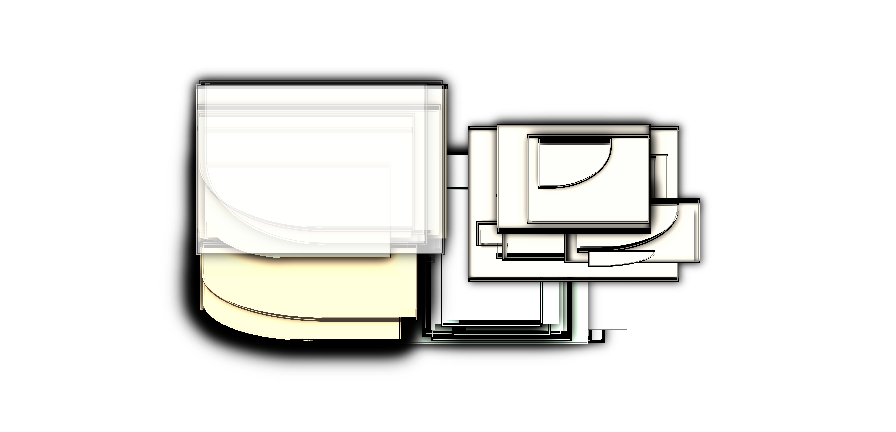
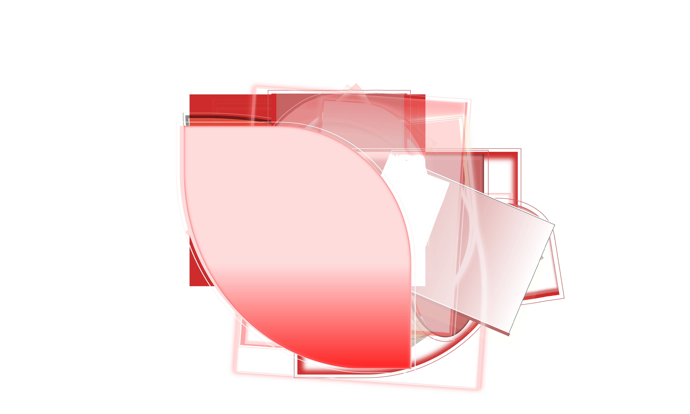
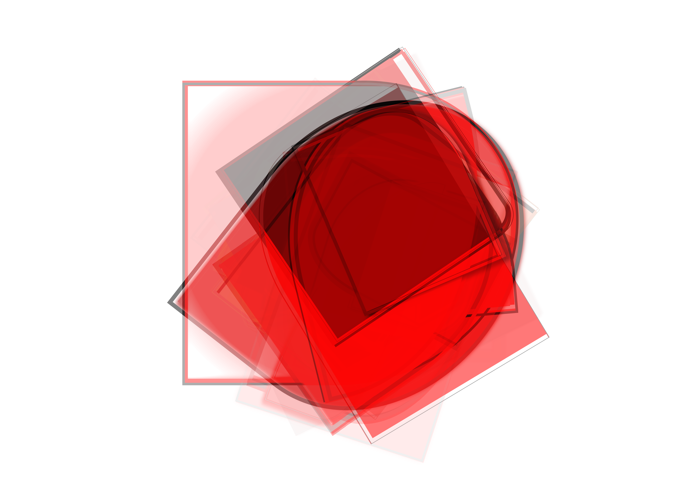
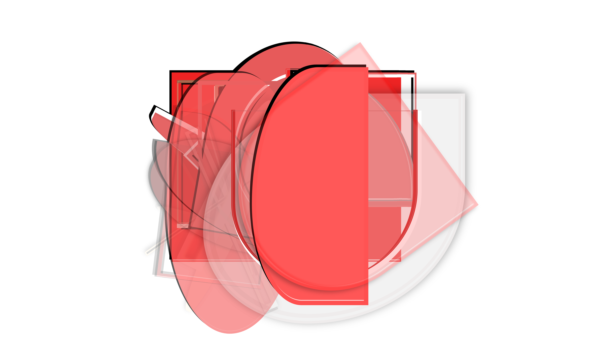
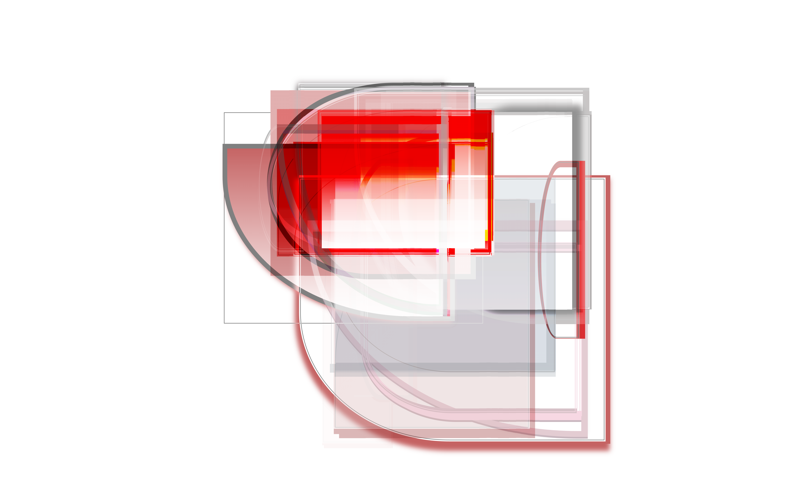

# Artwork-TUI (WIP)
Generative design tool with a terminal UI — compose layouts, render to canvas, export to SVG/PDF. Lorem ipsum dolor sit amet, consetetur sadipscing elitr, sed diam nonumy eirmod tempor invidunt ut labore et dolore magna aliquyam erat, sed diam voluptua. At vero eos et accusam et justo duo dolores et ea rebum. Stet clita kasd gubergren, no sea takimata sanctus est Lorem ipsum dolor sit amet. Lorem ipsum dolor sit amet, consetetur sadipscing elitr, sed diam nonumy eirmod tempor invidunt ut labore et dolore magna aliquyam erat, sed diam voluptua. At vero eos et accusam et justo duo dolores et ea rebum. Stet clita kasd gubergren, no sea takimata sanctus est Lorem ipsum dolor sit amet.

[Installation](#installation) / 
[Configuration](#configuration) / 
[API Reference](#reference) / 
[API Credit](#credit) / 
[Gallery](#gallery)

(Drag Video in here). Lorem ipsum dolor sit amet, consetetur sadipscing elitr, sed diam nonumy eirmod tempor invidunt ut labore et dolore magna aliquyam erat, sed diam voluptua. At vero eos et accusam et justo duo dolores et ea rebum. Stet clita kasd gubergren, no sea takimata sanctus est Lorem ipsum dolor sit amet. Lorem ipsum dolor sit amet, consetetur sadipscing elitr, sed diam nonumy eirmod tempor invidunt ut labore et dolore magna aliquyam erat, sed diam voluptua. At vero eos et accusam et justo duo dolores et ea rebum. Stet clita kasd gubergren, no sea takimata sanctus est Lorem ipsum dolor sit amet.

## Installation
Lorem ipsum dolor sit amet, consetetur sadipscing elitr, sed diam nonumy eirmod tempor invidunt ut labore et dolore magna aliquyam erat, sed diam voluptua. At vero eos et accusam et justo duo dolores et ea rebum.

### Generic Install (Native)
Lorem ipsum dolor sit amet, consetetur sadipscing elitr, sed diam nonumy eirmod tempor invidunt ut labore et dolore magna aliquyam erat, sed diam voluptua

```bash
curl -fsSL https://raw.githubusercontent.com/\
andri-berger/artwork-tui/main/install.sh | sh
```

### macOS (Homebrew)
Lorem ipsum dolor sit amet, consetetur sadipscing elitr, sed diam nonumy eirmod tempor invidunt ut labore et dolore magna aliquyam erat, sed diam voluptua

```bash
brew install andri-berger/artwork-tui/tap
playwright install chromium #deps are included
```

### Linux Arch (AUR)
Lorem ipsum dolor sit amet, consetetur sadipscing elitr, sed diam nonumy eirmod tempor invidunt ut labore et dolore magna aliquyam erat, sed diam voluptua

```bash
yay -S artwork-tui #Or use paru instead
playwright install chromium --with-deps
```

## Configuration
Lorem ipsum dolor sit amet, consetetur sadipscing elitr, sed diam nonumy eirmod tempor invidunt ut labore et dolore magna aliquyam erat, sed diam voluptua. At vero eos et accusam et justo duo dolores et ea rebum.

```bash
artwork-tui #Launches the TUI
```

<table width="100%">
    <tr>
        <th align="left">KPG</th>
        <th align="left">Terminal</th>
        <th align="left">Plattform</th>
        <th align="left">Notes</th>
    </tr>
    <tr>
        <td>&#x2705;</td>
        <td>Kitty</td>
        <td>Linux, macOS</td>
        <td>The originator — reference implementation</td>
    </tr>
    <tr>
        <td>&#x2705;</td>
        <td>Ghostty</td>
        <td>Linux, macOS</td>
        <td>The new kid on the block — native support</td>
    </tr>
    <tr>
        <td>&#x2705;</td>
        <td>WezTerm</td>
        <td>Linux, macOS</td>
        <td>Also supports Sixel + iTerm2 protocol — widest coverage</td>
    </tr>
    <tr>
        <td>&#x1F7E1;</td>
        <td>suckless</td>
        <td>Linux</td>
        <td>Patch available implementing a subset of KGP - not built-in</td>
    </tr>
    <tr>
        <td>&#x274C;</td>
        <td>foot</td>
        <td>Linux (Wayland)</td>
        <td>Sixel only — notable omission given it's the go-to Wayland minimal terminal</td>
    </tr>
    <tr>
        <td>&#x274C;</td>
        <td>Alacritty</td>
        <td>Linux, macOS</td>
        <td>Intentionally does not support font ligatures or modern image protocols</td>
    </tr>
    <tr>
        <td>&#x274C;</td>
        <td>iTerm2</td>
        <td>macOS</td>
        <td>Has its own inline image protocol (iTerm2 protocol), not KGP</td>
    </tr>
     <tr>
        <td>&#x274C;</td>
        <td>Konsole</td>
        <td>Linux</td>
        <td>Sixely only</td>
    </tr>
    <tr>
        <td>&#x274C;</td>
        <td>Hyper</td>
        <td>Linux, macOS</td>
        <td>Electron-based, no image protocol</td>
    </tr>
    <tr>
        <td>&#x274C;</td>
        <td>Tabby</td>
        <td>Linux, macOS</td>
        <td>No image protocol</td>
    </tr>
</table>


## API Reference
Lorem ipsum dolor sit amet, consetetur sadipscing elitr, sed diam nonumy eirmod tempor invidunt ut labore et dolore magna aliquyam erat, sed diam voluptua. At vero eos et accusam et justo duo dolores et ea rebum.

<table>
    <tr>
        <th align="left">Cell</th>
        <th align="left">Resource</th>
        <th align="left">Default</th>
        <th align="left">Description</th>
    </tr>
    <tr>
        <td>A0</td>
        <td>boolean</td>
        <td>nil</td>
        <td>Enable centering in typing-mode. Lorem ipsum dolor sit amet, consetetur sadipscing elitr, sed diam nonumy eirmod tempor invidunt ut labore et dolore magna aliquyam erat.</td>
    </tr>
    <tr>
        <td>A1</td>
        <td>boolean</td>
        <td>nil</td>
        <td>Enable anchoring in navigation-mode. Lorem ipsum dolor sit amet.</td>
    </tr>
    <tr>
        <td>A2</td>
        <td>boolean</td>
        <td>nil</td>
        <td>Enable anchoring in org-mode. Lorem ipsum dolor sit amet.</td>
    </tr>
    <tr>
        <td>A3</td>
        <td>boolean</td>
        <td>nil</td>
        <td>LTR vs RTL Alignment. Lorem ipsum dolor sit amet.</td>
    </tr>
    <tr>
        <td>A4</td>
        <td>boolean </td>
        <td>nil</td>
        <td>Centering horizontally. Lorem ipsum dolor sit amet.</td>
    </tr>
    <tr>
        <td>A5</td>
        <td>integer</td>
        <td>50</td>
        <td>Max-width in chars. Lorem ipsum dolor sit amet.</td>
    </tr>
    <tr>
        <td>A6</td>
        <td>integer</td>
        <td>0</td>
        <td>Left fringe width in px. Lorem ipsum dolor sit amet.</td>
    </tr>
    <tr>
        <td>B0</td>
        <td>integer</td>
        <td>0</td>
        <td>Vertical gap at the edge in px. Lorem ipsum dolor sit amet.</td>
    </tr>
    <tr>
        <td>B1</td>
        <td>integer</td>
        <td>0</td>
        <td>Vertical gap fringe left in px. Lorem ipsum dolor sit amet.</td>
    </tr>
    <tr>
        <td>B2</td>
        <td>select 0-3</td>
        <td>0</td>
        <td>Line-styles. 
        <br>0 = Lorem ipsum dolor sit amet. 
        <br>1 = Lorem ipsum dolor sit amet. 
        <br>2 = Lorem ipsum dolor sit amet. 
        <br>3 = Lorem ipsum dolor sit amet.</td>
    </tr>
    <tr>
        <td>B3</td>
        <td>select 0-3</td>
        <td>0</td>
        <td>Hierarchy treshold. 
        <br>0 = Lorem ipsum dolor sit amet. 
        <br>1 = Lorem ipsum dolor sit amet. 
        <br>2 = Lorem ipsum dolor sit amet. 
        <br>3 = Lorem ipsum dolor sit amet.</td>
    </tr>
    <tr>
        <td>B4</td>
        <td>select 0-3</td>
        <td>0</td>
        <td>Lines config header. 
        <br>0 = Lorem ipsum dolor sit amet. 
        <br>1 = Lorem ipsum dolor sit amet. 
        <br>2 = Lorem ipsum dolor sit amet. 
        <br>3 = Lorem ipsum dolor sit amet.</td>
    </tr>
    <tr>
        <td>B5</td>
        <td>select 0-3</td>
        <td>0</td>
        <td>Lines config mode. 
        <br>0 = Lorem ipsum dolor sit amet. 
        <br>1 = Lorem ipsum dolor sit amet. 
        <br>2 = Lorem ipsum dolor sit amet. 
        <br>3 = Lorem ipsum dolor sit amet.</td>
    </tr>
    <tr>
        <td>B6</td>
        <td>select 0-3</td>
        <td>0</td>
        <td>Char/line/word header. 
        <br>0 = Lorem ipsum dolor sit amet. 
        <br>1 = Lorem ipsum dolor sit amet. 
        <br>2 = Lorem ipsum dolor sit amet. 
        <br>3 = Lorem ipsum dolor sit amet.</td>
    </tr>
    <tr>
        <td>C0</td>
        <td>select 0-3</td>
        <td>0</td>
        <td>Char/line/word mode. 
        <br>0 = Lorem ipsum dolor sit amet. 
        <br>1 = Lorem ipsum dolor sit amet. 
        <br>2 = Lorem ipsum dolor sit amet. 
        <br>3 = Lorem ipsum dolor sit amet.</td>
    </tr>
    <tr>
        <td>C1</td>
        <td>string</td>
        <td>"/"</td>
        <td>First Separator header / mode. Lorem ipsum dolor sit amet.</td>
    </tr>
    <tr>
        <td>C2</td>
        <td>string</td>
        <td>" // "</td>
        <td>Second separator header / mode. Lorem ipsum dolor sit amet.</td>
    </tr>
    <tr>
        <td>C3</td>
        <td>string</td>
        <td>"writer"</td>
        <td>Fallback text if no org-parent. Lorem ipsum dolor sit amet.</td>
    </tr>
    <tr>
        <td>C4</td>
        <td>value</td>
        <td>'unspecified</td>
        <td>Faces inherit header mode line. Lorem ipsum dolor sit amet.</td>
    </tr>
    <tr>
        <td>C5</td>
        <td>value</td>
        <td>'unspecified</td>
        <td>Custom face of vertical line. Lorem ipsum dolor sit amet.</td>
    </tr>
</table>


## API Credit
Lorem ipsum dolor sit amet, consetetur sadipscing elitr, sed diam nonumy eirmod tempor invidunt ut labore et dolore magna aliquyam erat, sed diam voluptua. At vero eos et accusam et justo duo dolores et ea rebum.

<table width="100%">
    <tr>
        <th align="left">Layer</th>
        <th align="left">Name</th>
        <th align="left">
        Link </th>
    </tr>
    <tr>
        <td>Build</td>
        <td>Grip</td><td>
        <a href="//github.com/chrishrb/go-grip">
        https://github.com/chrishrb/go-grip</a></td>
    </tr>
    <tr>
        <td>Build</td>
        <td>Biome</td><td>
        <a href="//github.com/biomejs/biome">
        https://github.com/biomejs/biome</a></td>
    </tr>
    <tr>
        <td>Build</td>
        <td>Pyright</td><td>
        <a href="//github.com/microsoft/pyright">
        https://github.com/microsoft/pyright</a></td>
    </tr>
    <tr>
        <td>Build</td>
        <td>Ruff</td><td>
        <a href="//github.com/astral-sh/ruff">
        https://github.com/astral-sh/ruff</a></td>
    </tr>
    <tr>
        <td>Build</td>
        <td>Uv</td><td>
        <a href="//github.com/astral-sh/uv">
        https://github.com/astral-sh/uv</a></td>
    </tr>
    <tr>
        <td>Utilities</td>
        <td>Numpy</td><td>
        <a href="//github.com/numpy/numpy">
        https://github.com/numpy/numpy</a></td>
    </tr>
    <tr>
        <td>Utilities</td>
        <td>Random</td><td>
        <a href="https://github.com/d3/d3-random">
        https://github.com/d3/d3-random</a></td>
    </tr>
    <tr>
        <td>Framework</td>
        <td>Textual</td><td>
        <a href="//github.com/Textualize/textual">
        https://github.com/Textualize/textual</a></td>
    </tr>
    <tr>
        <td>Framework</td>
        <td>Textual Img</td><td>
        <a href="//github.com/lnqs/textual-image">
        https://github.com/lnqs/textual-image</a></td>
    </tr>
    <tr>
        <td>Conversion</td>
        <td>Html Image</td><td>
        <a href="//github.com/bubkoo/html-to-image">
        https://github.com/bubkoo/html-to-image</a></td>
    </tr>
    <tr>
        <td>Conversion</td>
        <td>Playwright</td><td>
        <a href="https://github.com/microsoft/playwright">
        https://github.com/microsoft/playwright</a></td>
    </tr>
    <tr>
        <td>Conversion</td>
        <td>OpenCV</td><td>
        <a href="https://github.com/opencv/opencv">
        https://github.com/opencv/opencv</a></td>
    </tr>
    <tr align="left">
        <td>Processing</td>
        <td>Wand</td><td>
        <a href="//github.com/emcconville/wand">
        https://github.com/emcconville/wand</a></td>
    </tr>
    <tr align="left">
        <td>Processing</td>
        <td>Pillow</td><td>
        <a href="//github.com/python-pillow/Pillow">
        https://github.com/python-pillow/Pillow</a></td>
    </tr>
    <tr>
        <td>Processing</td>
        <td>PixiJs</td><td>
        <a href="//github.com/pixijs/filters">
        https://github.com/pixijs/filters</a></td>
    </tr>
</table>

Lorem ipsum dolor sit amet, consetetur sadipscing elitr, sed diam nonumy eirmod tempor invidunt ut labore et dolore magna aliquyam erat, sed diam voluptua. At vero eos et accusam et justo duo dolores et ea rebum. Stet clita kasd gubergren, no sea takimata sanctus est Lorem ipsum dolor sit amet. Lorem ipsum dolor sit amet, consetetur sadipscing elitr, sed diam nonumy eirmod tempor invidunt ut labore et dolore magna aliquyam erat, sed diam voluptua. At vero eos et accusam et justo duo dolores et ea rebum. Stet clita kasd gubergren, no sea takimata sanctus est Lorem ipsum dolor sit amet.

## Gallery
Lorem ipsum dolor sit amet, consetetur sadipscing elitr, sed diam nonumy eirmod tempor invidunt ut labore et dolore magna aliquyam erat, sed diam voluptua. At vero eos et accusam et justo duo dolores et ea rebum. Stet clita kasd gubergren, no sea takimata sanctus est Lorem ipsum dolor sit amet. Lorem ipsum dolor sit amet, consetetur sadipscing elitr, sed diam nonumy eirmod tempor invidunt ut labore et dolore magna aliquyam erat, sed diam voluptua. At vero eos et accusam et justo duo dolores et ea rebum. Stet clita kasd gubergren, no sea takimata sanctus est Lorem ipsum dolor sit amet.

<table>
  <tr>
    <td><a href="Backend/template/1745003993.png">
    
    </a></td>
    <td><a href="Backend/template/1745003866.png">
    
    </a></td>
    <td><a href="Backend/template/1745003804.png">
    
    </a></td>
    <td><a href="Backend/template/1745003726.png">
    
    </a></td>
    <td><a href="Backend/template/1745003613.png">
    
    </a></td>
    <td><a href="Backend/template/1745003563.png">
    
    </a></td>
  </tr>
  <tr>
    <td><a href="Backend/template/1745003407.png">
    
    </a></td>
    <td><a href="Backend/template/1745003074.png">
    
    </a></td>
    <td><a href="Backend/template/1745002977.png">
    
    </a></td>
    <td><a href="Backend/template/1745002888.png">
    
    </a></td>
    <td><a href="Backend/template/1745002495.png">
    
    </a></td>
    <td><a href="Backend/template/1744168809.png">
    
    </a></td>
  </tr>
  <tr>
    <td><a href="Backend/template/1744168798.png">
    
    </a></td>
    <td><a href="Backend/template/1744168791.png">
    
    </a></td>
    <td><a href="Backend/template/1744168777.png">
    
    </a></td>
    <td><a href="Backend/template/1744168764.png">
    
    </a></td>
    <td><a href="Backend/template/1744168743.png">
    
    </a></td>
    <td><a href="Backend/template/1744168733.png">
    
    </a></td>
  </tr>
  <tr>
    <td><a href="Backend/template/1744168727.png">
    
    </a></td>
    <td><a href="Backend/template/1744168722.png">
    
    </a></td>
    <td><a href="Backend/template/1744168599.png">
    
    </a></td>
    <td><a href="Backend/template/1744168593.png">
    
    </a></td>
    <td><a href="Backend/template/1744168591.png">
    
    </a></td>
    <td><a href="Backend/template/1744168589.png">
    
    </a></td>
  </tr>
  <tr>
    <td><a href="Backend/template/1744168586.png">
    
    </a></td>
    <td><a href="Backend/template/1744168580.png">
    
    </a></td>
    <td><a href="Backend/template/1744168563.png">
    
    </a></td>
    <td><a href="Backend/template/1744168542.png">
    
    </a></td>
    <td><a href="Backend/template/1744168532.png">
    
    </a></td>
    <td><a href="Backend/template/1744168518.png">
    
    </a></td>
  </tr>
  <tr>
    <td><a href="Backend/template/1744168512.png">
    
    </a></td>
    <td><a href="Backend/template/1744168505.png">
    
    </a></td>
    <td><a href="Backend/template/1744168452.png">
    
    </a></td>
    <td><a href="Backend/template/1744168430.png">
    
    </a></td>
    <td><a href="Backend/template/1744168424.png">
    
    </a></td>
    <td><a href="Backend/template/1744168421.png">
    <!-- replace with bandcamp album-link !!! -->
    
    </a></td>
  </tr>
</table>

## Links
Lorem ipsum dolor sit amet, consetetur sadipscing elitr, sed diam nonumy eirmod tempor invidunt ut labore et dolore magna aliquyam erat, sed diam voluptua.

https://fmwconcepts.com/imagemagick
<br>https://search.creativecommons.org
<br>https://archive.org/details/image
<br>https://visioncortex.org/vtracer
<br>https://artvee.com/c/abstract
<br>https://gmic.eu/gallery
<br>https://openverse.org


<!-- Abstract Art	
Modern Art	
Geometric Art	
Minimalist Art	
Generative Art	
Algorithmic Art	
Procedural Art	
Contemporary Art	

Abstract Painting
Modern Painting
Geometric Painting
Minimalist Painting
Generative Painting
Algorithmic Painting
Procedural Painting
Contemporary Painting

Create Abstract Art Fast
Your Custom Art in HD
Abstract Prints, Your Way
Make Unique Abstract Art
Design Abstract Art Now
Abstract Art, No AI Needed
Generate Art, Download HD
Abstract Canvas Generator
Abstract Art — Your Style
Make Art, Print on Canvas
Create Abstract Wall Art
DIY Abstract Art Online
High-Res Abstract Prints
Custom Art, Instant File
Abstract Art, No Limits

Design Abstract Wall Art, Print It, Show It Off
Make Abstract Art That’s 100% You — No AI Required
Tired of AI Art? Make Your Own Abstract Masterpiece
Design Abstract Art, Download in HD, Print on Canvas
Create Custom Abstract Art — High-Res, Ready to Print
Abstract Art Generator: From Screen to Wall in Minutes
Generate Abstract Art You Can Actually Download & Print
DIY Abstract Art: Make It, Download It, Print It, Flex It
Design Your Own Abstract Art — No AI, Just Your Imagination
Unleash Your Inner Artist: Create Custom Abstract Art for Print
Your Vision, Your Art: Generate Stunning Abstracts, Download or Print
Make custom abstract art in minutes. Download or print your masterpiece!
Design your abstract art and print it or download high-res files instantly.
Create unique abstract artwork online — print on canvas or download HD art.
Generate abstract art that’s 100% yours. Print or save high-resolution art.
Your art, your rules. Create abstract pieces, download, or print on canvas.
-->

<br>
<br>
<br>
