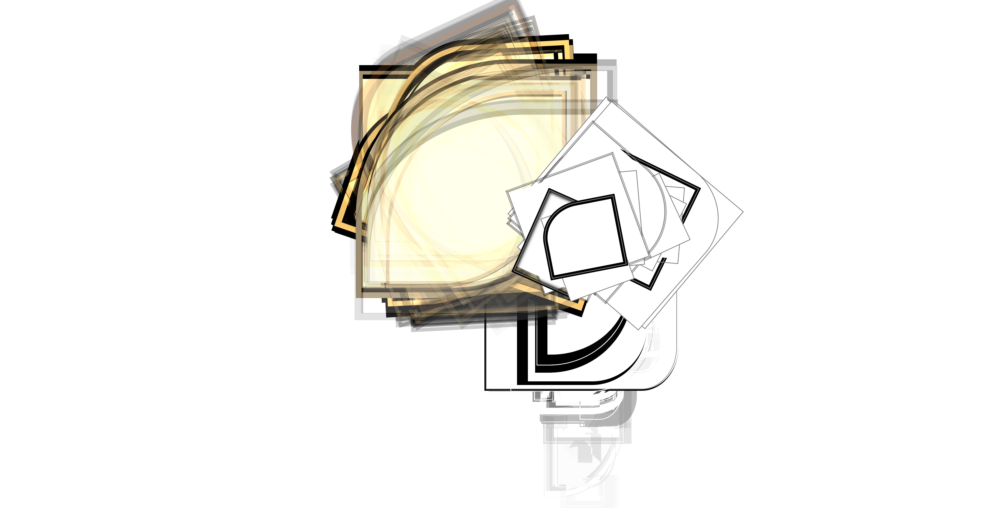
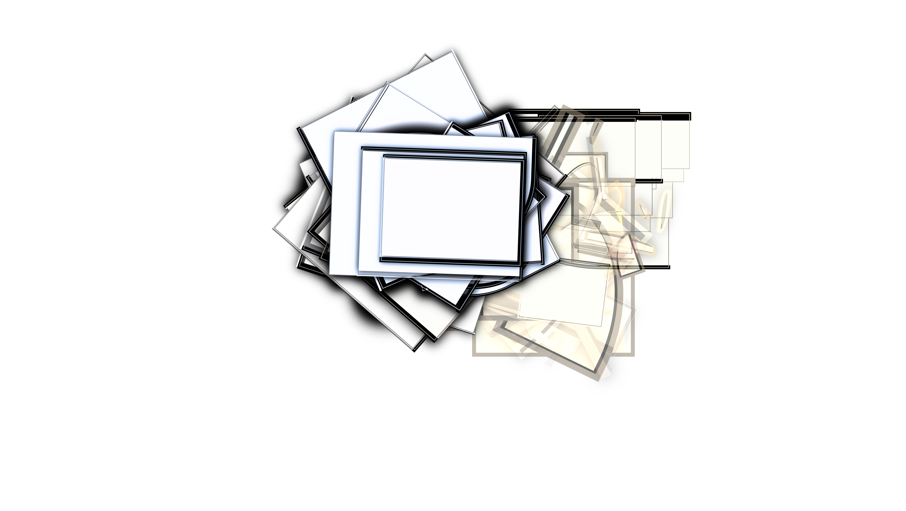
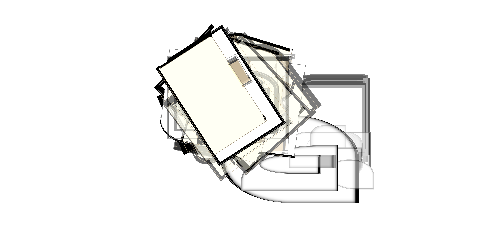
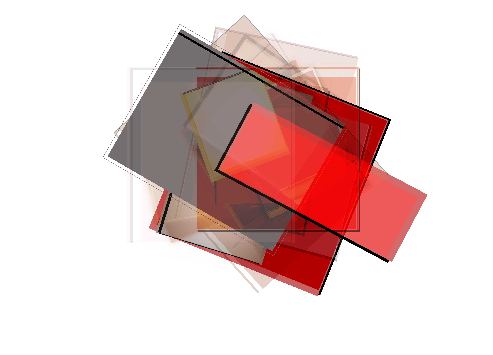
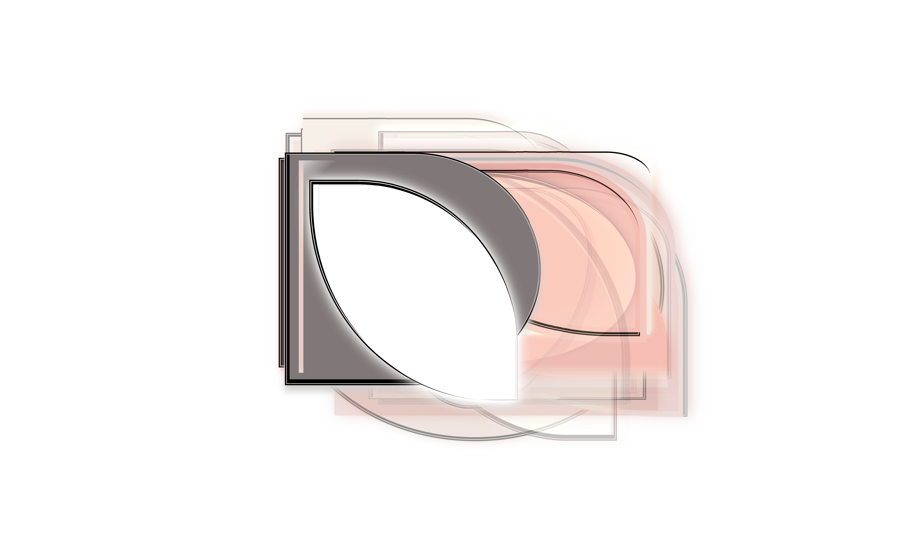
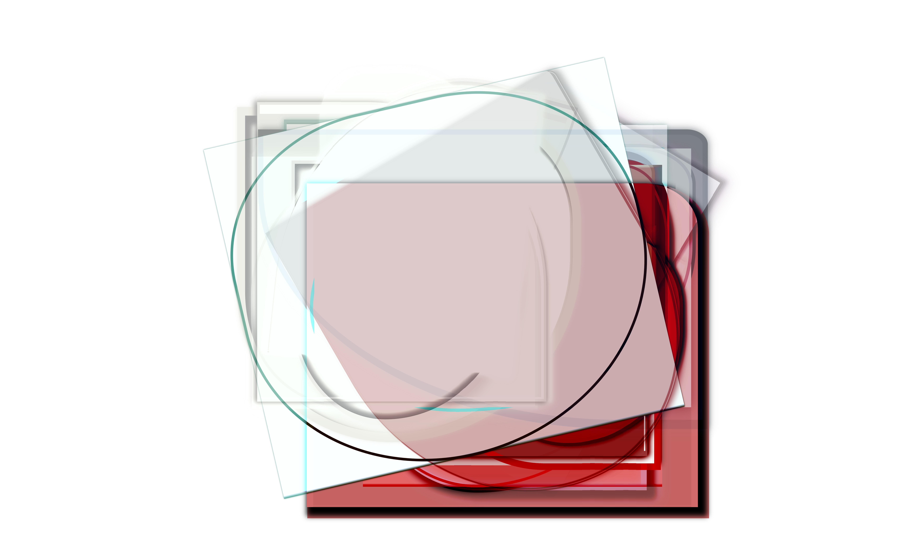

<br>



# artwork-tui
Generative design tool with a terminal UI — compose layouts, render to canvas, export to SVG/PDF. Lorem ipsum dolor sit amet, consetetur sadipscing elitr, sed diam nonumy eirmod tempor invidunt ut labore et dolore magna aliquyam erat, sed diam voluptua. At vero eos et accusam et justo duo dolores et ea rebum. Stet clita kasd gubergren, no sea takimata sanctus est Lorem ipsum dolor sit amet. Lorem ipsum dolor sit amet, consetetur sadipscing elitr, sed diam nonumy eirmod tempor invidunt ut labore et dolore magna aliquyam erat, sed diam voluptua. At vero eos et accusam et justo duo dolores et ea rebum. Stet clita kasd gubergren, no sea takimata sanctus est Lorem ipsum dolor sit amet.

Built with [Textual](https://github.com/Textualize/textual) · [Playwright](https://playwright.dev) · [PixiJS](https://pixijs.com)


<br>

## Prerequisites

Install [mise](https://mise.jdx.dev) — manages all required runtimes and tools:

```bash
# macOS
brew install mise

# Arch Linux
yay -S mise

# Universal
curl https://mise.run | sh


## Installation

**macOS (Homebrew)**
```bash
brew install you/tap/layoutgen
```

**Arch Linux (AUR)**
```bash
yay -S layoutgen
```

**Universal (pip/uv)**
```bash
uv tool install layoutgen
```


## Usage

```bash
layoutgen
```

Launches the TUI. Keyboard-driven, no mouse required.

---

## Development
```

### Setup

```bash
git clone https://github.com/you/layoutgen
cd layoutgen
mise install    # python, uv, biome, esbuild, typescript
uv sync         # python dependencies
uv run layoutgen
```

### Commands
```bash
uv run layoutgen        # launch TUI
uv run pytest           # run tests
uv run ruff check .     # lint Python
biome check frontend/   # lint + format JS
tsc --noEmit            # type check JS
```


## Options
Lorem ipsum dolor sit amet, consetetur sadipscing elitr, sed diam nonumy eirmod tempor invidunt ut labore et dolore magna aliquyam erat, sed diam voluptua. At vero eos et accusam et justo duo dolores et ea rebum. Stet clita kasd gubergren, no sea takimata sanctus est Lorem ipsum dolor sit amet. Lorem ipsum dolor sit amet, consetetur sadipscing elitr, sed diam nonumy eirmod tempor invidunt ut labore et dolore magna aliquyam erat, sed diam voluptua. At vero eos et accusam et justo duo dolores et ea rebum. Stet clita kasd gubergren, no sea takimata sanctus est Lorem ipsum dolor sit amet.

<table>
  <tr>
    <th>Property</th>
    <th>Resource</th>
    <th>Default</th>
    <th>Description</th>
  </tr>
  <tr>
    <td>writer-org--00</td>
    <td></td>
    <td></td>
    <td></td>
  </tr>
  <tr>
    <td>writer-org--01</td>
    <td></td>
    <td></td>
    <td></td>
  </tr>
    <tr>
    <td>writer-org--02</td>
    <td></td>
    <td></td>
    <td></td>
  </tr>
    <tr>
    <td>writer-org--03g</td>
    <td></td>
    <td></td>
    <td></td>
  </tr>
</table>


## Stack
Lorem ipsum dolor sit amet, consetetur sadipscing elitr, sed diam nonumy eirmod tempor invidunt ut labore et dolore magna aliquyam erat, sed diam voluptua. At vero eos et accusam et justo duo dolores et ea rebum. Stet clita kasd gubergren, no sea takimata sanctus est Lorem ipsum dolor sit amet. Lorem ipsum dolor sit amet, consetetur sadipscing elitr, sed diam nonumy eirmod tempor invidunt ut labore et dolore magna aliquyam erat, sed diam voluptua. At vero eos et accusam et justo duo dolores et ea rebum. Stet clita kasd gubergren, no sea takimata sanctus est Lorem ipsum dolor sit amet.

<table>
  <tr>
    <th>License</th>
    <th>Layer</th>
    <th>Technology</th>
    <th>Link</th>
  </tr>
  <tr>
    <td>GPL3</td>
    <td>TUI Framework</td>
    <td>Textual</td>
    <td><a href="https://github.com/Textualize/textual">
    https://github.com/Textualize/textual</a></td>
  </tr>
  <tr>
    <td>GPL3</td>
    <td>Canvas rendering</td>
    <td>Playwright</td>
    <td><a href="https://github.com/microsoft/playwright">
    https://github.com/microsoft/playwright</a></td>
  </tr>
  <tr>
    <td>GPL3</td>
    <td>Canvas rendering</td>
    <td>PixiJs</td>
    <td><a href="https://github.com/pixijs/pixijs">
    https://github.com/pixijs/pixijs</a></td>
  </tr>
  <tr>
      <td></td>
  <td>Image processing</td>
    <td>OpenCV, Pillow</td>
    <td><a href="https://github.com/Textualize/textual">
    https://github.com/Textualize/textual</a></td>
  </tr>
  <tr>
      <td></td>
    <td>SVG conversion</td>
    <td>vtracer, resvg-py</td>
    <td><a href="https://github.com/Textualize/textual">
    https://github.com/Textualize/textual</a></td>
  </tr>
  <tr>
      <td></td>
    <td>PDF support</td>
    <td>textual-pdf</td>
    <td><a href="https://github.com/Textualize/textual">
    https://github.com/Textualize/textual</a></td>
  </tr>
  <tr>
      <td></td>
    <td>Audio</td>
    <td>sounddevice, soundfile</td>
    <td><a href="https://github.com/Textualize/textual">
    https://github.com/Textualize/textual</a></td>
  </tr>
</table>


## Gallery
Lorem ipsum dolor sit amet, consetetur sadipscing elitr, sed diam nonumy eirmod tempor invidunt ut labore et dolore magna aliquyam erat, sed diam voluptua. At vero eos et accusam et justo duo dolores et ea rebum. Stet clita kasd gubergren, no sea takimata sanctus est Lorem ipsum dolor sit amet. Lorem ipsum dolor sit amet, consetetur sadipscing elitr, sed diam nonumy eirmod tempor invidunt ut labore et dolore magna aliquyam erat, sed diam voluptua. At vero eos et accusam et justo duo dolores et ea rebum. Stet clita kasd gubergren, no sea takimata sanctus est Lorem ipsum dolor sit amet.

<table>
  <tr>
    <td><a href="gallery/1745003993.png">
    
    </a></td>
    <td></td>
    <td></td>
    <td></td>
    <td></td>
    <td></td>
  </tr>
  <tr>
    <td></td>
    <td></td>
    <td></td>
    <td></td>
    <td></td>
    <td></td>
  </tr>
  <tr>
    <td></td>
    <td></td>
    <td></td>
    <td></td>
    <td></td>
    <td></td>
  </tr>
  <tr>
    <td></td>
    <td></td>
    <td></td>
    <td></td>
    <td></td>
    <td></td>
  </tr>
  <tr>
    <td></td>
    <td></td>
    <td></td>
    <td></td>
    <td></td>
    <td></td>
  </tr>
  <tr>
    <td></td>
    <td></td>
    <td></td>
    <td></td>
    <td></td>
    <td></td>
  </tr>
</table>
